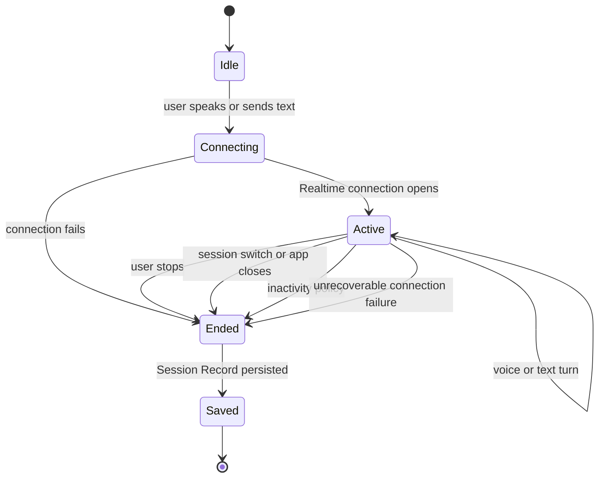

# Session Lifecycle

## Definition

A **Session** is one live conversation with the Realtime Agent. It begins when the user activates a Realtime connection and ends when the user stops it, the application ends it, or the connection cannot continue.

A Session is not a saved chat thread and is not a Codex Task. After a Session ends, the application stores a **Session Record** for later inspection. A future conversation creates a new Session, even if it refers to the same Codex Task.

## Intended lifecycle

The active UI state may be `ready`, `listening`, `thinking`, or `speaking`. These states describe one Session; they do not create separate Sessions.

## View behavior

- Companion and Chat display the same active Session.
- Expanding or collapsing the window does not reconnect Realtime.
- Spoken and typed messages appear in one ordered transcript.
- Starting a separate Session ends the active Session first.
- Chat may inspect old Session Records without treating them as live conversations.

## Session Record

The initial local record should be enough for debugging and continuity:

| Field | Purpose |
| --- | --- |
| ID | Stable local identity |
| Start and end time | Establish duration and ordering |
| End reason | User stop, inactivity, switch, close, or failure |
| Transcript | Final user and assistant messages with voice/text source |
| Capability activity | Codex actions requested and their outcomes |
| Errors | Sanitized failures relevant to the session |

Local storage is sufficient for the first slice. Cloud synchronization, accounts, retention policy, and production database selection are outside the current scope.

## Current code behavior

The implementation currently uses `ChatSession` for a persistent record with a title, timestamps, and messages. Selecting that record and sending a message may open a new Realtime connection, replay up to 50 saved messages, and continue appending to the same record.

That behavior conflicts with the agreed model in two ways:

1. One persisted `ChatSession` may span multiple live Realtime conversations.
2. The record does not capture a live Session's end time, end reason, capability activity, or errors.

Until the code is aligned, documentation and new product work should use **Session** only for the live conversation and **Session Record** for persisted history. Existing type names should be treated as implementation vocabulary scheduled for clarification, not as the domain definition.

## Current end conditions

The scaffold disconnects Realtime when the user stops voice, selects or deletes a saved record, creates a new connection, closes the app, or encounters a fatal connection error. Switching between Companion and Chat does not disconnect.

Automatic inactivity sleep is not implemented yet. When it is introduced, it should be an explicit Session end reason rather than silently recycling the same live connection.
