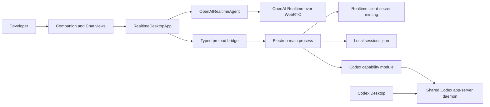
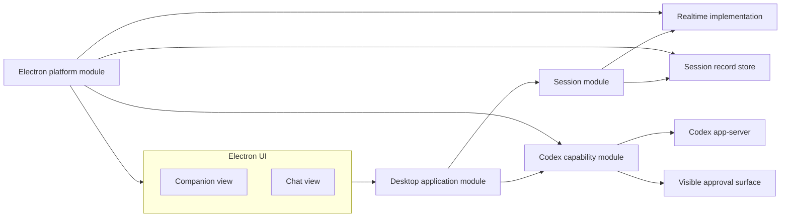

# Architecture

This document separates the repository's current implementation from its intended direction. Proposed modules and seams are design guidance, not claims about code that already exists.

## Current implementation

The scaffold is a single Electron application with a browser-based Realtime agent.

### Existing modules

| Area | Current location | Responsibility |
| --- | --- | --- |
| Realtime agent | `src/agent/` | WebRTC, microphone/audio, Realtime events, state, typed messages, and history replay |
| Renderer application | `src/application/renderer/` | UI markup, view switching, session selection, agent orchestration, and persistence calls |
| Electron main | `src/application/main/` | window lifecycle, media permission, secret minting, IPC handlers, and local storage |
| Preload | `src/application/preload/` | narrow renderer-to-main bridge |
| Contracts | `src/contracts/` | session and IPC values shared across processes |
| Codex capability | `src/codex/` | shared daemon transport, task subscriptions, intent-level task control, Codex Live selection, updates, and approval observation |

### Useful existing seams

- `AgentSession` keeps Electron imports out of the Realtime agent and gives the renderer a compact conversation interface.
- `DesktopBridge` restricts renderer access to explicit main-process operations.
- `SessionStore` localizes JSON reads, validation, serialized writes, and atomic file replacement.
- `WindowMode` changes Companion and Chat presentation without replacing the renderer or connection.

### Current pressure points

- `RealtimeDesktopApp` owns rendering, event handling, session selection, connection orchestration, and persistence. New capabilities would increase this concentration.
- `OpenAIRealtimeAgent` owns both the product-facing session behavior and the OpenAI WebRTC protocol implementation.
- The Electron main entry point combines platform lifecycle with application IPC wiring.
- Bob-created and resumed Codex Tasks use approval policy `never` and sandbox
  `danger-full-access` for autonomous local delegation. Interactive requests
  encountered while monitoring other Tasks are observed but not answered.
- The persisted `ChatSession` model does not match the agreed meaning of Session.
- There are no automated tests guarding the existing interfaces.

These are design inputs, not a request for a broad rewrite. Changes should be made at the seam required by the next behavior.

## Intended direction

The target shape keeps the application concrete while isolating the behavior most likely to grow.

### Session module

The Session module should own one live conversation: start, state transitions, voice/text input, final transcript events, and end. Its interface is the primary test surface. OpenAI-specific SDP exchange, event names, audio elements, and secret details stay in its implementation.

The current `AgentSession` interface is a useful starting point, but its `connect(history, mode)` shape reflects persisted chat reconnection rather than the agreed lifecycle. Align the model before adding Codex behavior.

### Desktop application module

The application module coordinates the active Session, selected view, saved Session Records, and capability results. Companion and Chat should render application state; neither view should own Codex process management or Realtime protocol details.

### Codex capability module

`CodexCapability` exposes one intent-level command interface: start, continue,
monitor, set Codex Live, interrupt, open, search, and status. Its open/search operations cover
both configured local projects and persisted Codex Tasks. `CodexAppServerClient` hides the
managed-daemon lifecycle, proxy WebSocket framing, JSON-RPC, task discovery,
subscriptions, reconnection, and event aggregation. The renderer never owns a
Codex process, protocol parser, credential, or approval response.

Bob polls `thread/loaded/list` on the shared daemon and resumes newly loaded
Codex Tasks, which lets Desktop-originated turns become observable without
manually copying every task ID. Explicit search and monitor commands cover
persisted Tasks that are not currently loaded.

Codex Live marks at most one Task. The capability tags events for that Task;
the renderer narration policy speaks completed `agentMessage` items plus
attention, error, and terminal changes. Raw message deltas remain transport
state and are never turned into overlapping speech responses. Codex Live is a
runtime setting and does not grant approval authority.

Do not introduce a generalized plugin interface merely for the first Codex implementation. When a second capability demonstrates shared variation, extract the smallest common capability seam supported by both implementations.

### Session record store

The store persists completed Session Records independently of the live Realtime connection. Local JSON is sufficient for now. The existing `SessionStore` already provides useful write serialization, validation, restrictive file permissions, and atomic replacement; its schema needs to evolve to represent one completed live Session.

### Electron platform module

Electron-specific behavior includes windows, screen placement, media permission, environment loading, filesystem paths, IPC, and child processes. Product modules should receive these dependencies rather than importing Electron directly.

## Dependency rules

1. UI views depend on application state and commands, not Realtime or Codex protocols.
2. The Session module does not import Electron or Codex modules.
3. The Codex module does not render UI or interpret voice transcripts.
4. Standard API credentials and Codex process ownership remain in Electron main.
5. Cross-process data uses explicit contracts and is validated in Electron main.
6. A new capability should concentrate its implementation in one module and cross an existing application seam.
7. Introduce a new shared interface only when at least two implementations or a production/test adapter make the variation real.

## Security constraints

- The standard OpenAI API key stays in Electron main; the renderer receives only a short-lived Realtime client secret.
- The renderer runs with context isolation, no Node integration, and sandboxing enabled.
- Persisted transcript text and error details must be sanitized before storage or display.
- Voice or typed conversation content must never silently answer Codex
  interactive requests. Bob's own delegated Tasks avoid approval requests by
  using the explicit YOLO execution policy.
- Capability events crossing IPC must be validated as strictly as current session messages.

## Verification strategy

Test through module interfaces:

- Session lifecycle and transcript behavior through the Session interface with local browser/Realtime stand-ins.
- Record creation and persistence through the store interface using a temporary filesystem.
- Codex behavior through its intent-level interface with an in-memory client,
  plus a real managed-daemon smoke test for transport and event delivery.
- Companion/Chat continuity through the application interface.

Real microphone permission, audio playback, Realtime networking, Electron window behavior, and Codex approval presentation still require a live macOS smoke test.
